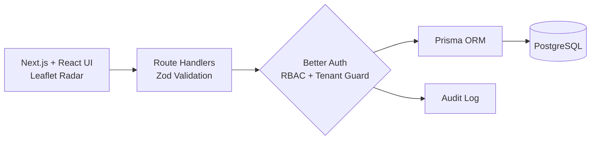
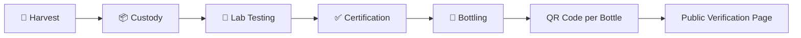

  

 

## 👋 About

I'm a **B.Tech IT student at Delhi Technological University** (2024 – 2028) who builds full-stack products end to end: clean interfaces on the front, secure and well-structured systems behind them.

My recent work covers **multi-tenant SaaS architecture, real-time GPS tracking, role-based access control, row-level security and AI-powered tooling**, backed by automated tests and shipped through short, feedback-driven sprints.

| 🎓 Education | 💼 Experience | 🧪 Test Coverage | 🏗️ Focus |
|:---:|:---:|:---:|:---:|
| DTU, B.Tech IT | 2 internships in 2026 | 259 automated tests across 15 suites (FieldFlow) | Full-stack, security, real-time systems |

 

## 💼 Experience

<table>
<tr>
<td width="24%" valign="top"><b>Jul – Aug 2026</b> Remote, India</td>
<td>
<b>Software Engineer Intern</b> · Dawn Digitech LLP 
Worked on AI-led software projects, turning requirements into working features and cloud application workflows. Delivered technical milestones in one-week MVP sprints with weekly evaluations, including low-code cloud development for client-specific needs.
</td>
</tr>
<tr>
<td valign="top"><b>Jun – Jul 2026</b> New Delhi</td>
<td>
<b>Full Stack Developer Intern</b> · Centre of Excellence for Happiness, DTU 
Built a survey platform on <code>Next.js</code> + <code>Supabase</code> + <code>PostgreSQL</code> covering survey creation, response collection and analytics-ready data. Designed normalized schemas and REST APIs, and secured submissions with Supabase Auth and Row-Level Security.
</td>
</tr>
</table>

 

## 🚀 Featured Projects

Ordered by depth and technical complexity.

### 🛰️ FieldFlow: Multi-Tenant Field Operations Platform
> A full-stack platform for managing field teams, dispatching, route planning, real-time GPS tracking and operational audits.

- **Route planning:** multi-stop routes with technician assignment, Haversine distance calculation and scheduled dispatch
- **Live radar:** real-time GPS telemetry on a Leaflet/OpenStreetMap map for live technician tracking
- **Geofencing:** geofence-based visit verification with server-side visit duration tracking
- **Security:** multi-tenant RBAC, audit logging, secure authentication and strict tenant isolation
- **Quality:** CSV audit reporting, verified with **259 automated tests across 15 suites**

`Next.js` `React` `TypeScript` `Tailwind CSS` `Prisma` `PostgreSQL` `Better Auth` `Leaflet` `Zod`

 

### 🍯 Honey Chain: Digital Honey Traceability Platform

> An end-to-end traceability platform connecting beekeepers, laboratories, manufacturers and consumers through unit-level QR verification.

- **5-stage workflow:** harvest → custody → laboratory testing → certification → bottling
- **QR verification:** real scannable QR codes with unique bottle-level serialization and public verification
- **Role-based workflows:** beekeepers, manufacturers, laboratories, logistics and administrators
- **Bilingual:** English and Hindi support for consumer and operational flows
- **Trust and integrity:** verification pages with origin, lab data and supply-chain history, backed by audit logging, mass-balance validation and data sanitization

`Next.js` `React` `TypeScript` `Tailwind CSS` `QRCode` `Radix UI` `Vercel`

 

### 📈 LifeStack: AI-Powered Personal Analytics Dashboard
> A solo-built productivity platform combining habit tracking, journaling, daily planning and performance visualization in one dashboard.

- **AI insights:** Grok API generates weekly and monthly reports with structured data validation
- **Dashboards:** interactive charts (Recharts), streak tracking and goal analytics
- **Auth:** secure authentication and session management with NextAuth.js
- **Reports:** automated PDF report generation, deployed serverlessly on Vercel

`Next.js 14` `TypeScript` `Prisma` `PostgreSQL` `NextAuth.js` `Grok API` `Recharts` `Tailwind CSS`

 

### 🌿 CESH: Digital Well-Being & Survey Platform
> A full-stack survey platform for collecting, processing and analyzing holistic well-being data.

- **Surveys:** interactive survey platform on Next.js and Supabase across physical, psychological, social, environmental and spiritual dimensions
- **ML pipeline:** Python serverless pipeline using Random Forest to classify well-being categories, with automated analysis and results visualization
- **Security:** Supabase Authentication and secure PostgreSQL access

`Next.js` `React` `Tailwind CSS` `Python` `Supabase` `PostgreSQL` `scikit-learn` `Pandas` `NumPy`

 

### 📄 AI Resume Analyzer & Maker
> Upload a resume, get an ATS score and role-specific feedback, then build a better one.

- **Six-dimension AI evaluation:** ATS compatibility, content quality, skills, structure, professional impact and role alignment, powered by the Grok API
- **Parsing:** PDF and DOCX resume ingestion with keyword matching
- **Builder:** ATS-friendly templates, real-time preview and PDF export using reusable React components

`Next.js` `JavaScript` `Tailwind CSS` `Grok API`

 

### 🌐 Developer Portfolio: High-Performance Personal Website
> A fully responsive personal site showcasing projects, skills and technical writing.

- **Performance:** strong Lighthouse scores through image optimization, lazy loading and minimal render-blocking resources
- **Motion:** fluid animations and page transitions with Framer Motion
- **Accessibility:** semantic HTML, proper contrast ratios and keyboard navigation
- **Delivery:** SEO-optimized, deployed on Vercel with automatic CI/CD from GitHub

`Next.js` `React` `JavaScript` `Tailwind CSS` `Framer Motion` `Vercel`

 

 

### 🎨 Agency Landing Page: Modern Digital Agency Website
> A conversion-focused agency landing page with smooth animations and clean layouts.

- **Sections:** hero, service showcase, testimonials and CTA-driven layouts for better engagement
- **Motion:** smooth transitions and interactions with Framer Motion
- **Responsive and accessible:** optimized for desktop, tablet and mobile, with strong typography hierarchy and spacing
- **Performance:** efficient asset loading and responsive image handling, deployed on Vercel with continuous deployment

`Next.js` `React` `JavaScript` `Tailwind CSS` `Framer Motion` `Vercel`

 

 

## 🧰 Tech Stack

| Area | Tools |
|---|---|
| **Languages** | C++, JavaScript, TypeScript, Python, SQL |
| **Frontend** | React.js, Next.js, Tailwind CSS, HTML5, CSS3 |
| **Backend** | Node.js, REST APIs, Next.js Route Handlers, Prisma ORM |
| **Databases** | PostgreSQL, MongoDB |
| **Auth & Security** | Better Auth, Supabase Auth, RBAC, Row-Level Security |
| **Tools** | Git, GitHub, Vercel, Postman, VS Code |
| **CS Fundamentals** | DSA, OOP, DBMS, Operating Systems, Computer Networks |

 

## 🎯 Currently

- 🔨 Building and hardening **FieldFlow** with tighter tenant isolation and more real-time features
- 📚 Sharpening DSA in C++ alongside core CS subjects
- 🌍 Open to **internships, full-time roles and freelance work** in full-stack development

 

### Let's build something great together

